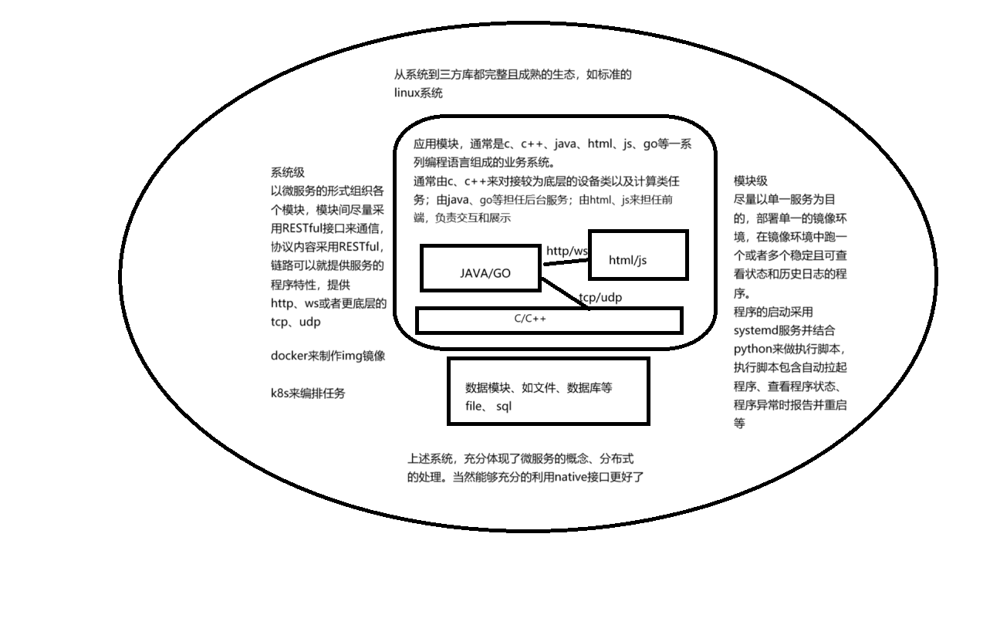
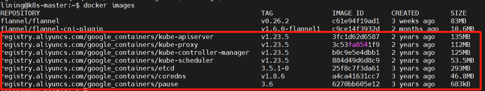
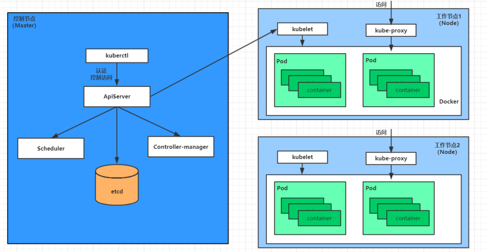
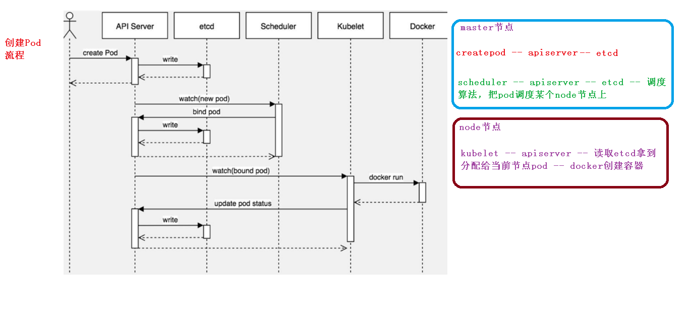
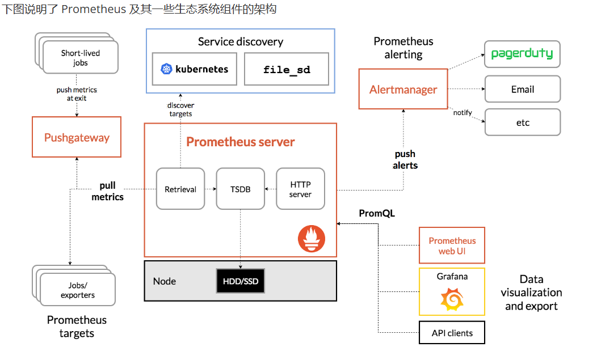

# 从python学习扩展到运维
    由于shell脚本的不可调试以及这种情况的假设：
    简单的程序加入系统，在系统不是标准的情况下，使用init文件；系统标准的情况下，可以通过linux系统的systemd,做一个service文件来启动服务
    复杂的程序，可以使用编写脚本如shell(win上为bat)来模拟系统逐步启动程序，并对程序的状态进行监控。
    但是脚本如shell或者bat，不能进行调试，对于编写者的能力是巨大的挑战，尤其是在一些不可恢复操作上。这种时候就需要python来充替脚本的角色了，
    同时python还兼具编程的特色。
    从历史的角度看待编程世界：
        第一代语言 二进制bin，计算机直接识别并执行的
        第二代语言 汇编,稍微扩展了可读性
        第三代语言       shell(1970)
                        c(1972)
                        sql(1974)
                        c++(1979)
                        HTML(1990)
                        python(1991)
                        css(1994)
                        java(1995)
                        javascript(1995)
                        go(2007)
                        docker(2013)
                        k8s(2014)
    上面的第三代语言列举了本人常用编程语言的生日，每种语言的出现都有特定的时代背景和它擅长解决的问题，借鉴已存在的编程语言的优点，并与之兼容。
    编程语言的强大依赖出生时的好爹，强大的公司背景或者个人实力，这是天赋；同样依赖后天的发育环境，比如开源带来的集思广益。
    选择编程语言就是选择工具，同时在人工智能的冲击下，基础的编程技巧显得乏力，且不具备时间竞争力，复合编程能力，系统的架构组织能力才具备时间竞争力。
---

**本文中服务和应用是等同了，都是代表容器中运行的业务进程**

    学习docker和k8s分布式系统管理工具，能够更好的理解现代互联网大型系统的结构，从大处见真知。
    常用端口(单体应用在对外提供服务端口的时候，应该尽量避开这些常用的系统端口，以保证应用在系统中的适应性,一般至少是10000以上)
    服务名称                端口号     说明
    ftp                     21      文件上传下载
    ssh                     22      linux远程登录
    telnet                  23      win远程登录
    smtp                    25      简单邮件传输服务
    dns                     53      域名解析服务
    http                    80      web
    https                   443     加密的web
    
    mysql                   3306    mysql数据库
    PostgreSQL              5432    
    redis                   6379
    
    docker                  本地socket
    k8s         
    kube-apiserver          6443
    etcd                    2379（客户端通信）和 2380（节点间通信）
    kube-controller-manager 10252
    kube-scheduler          10251
    kubelet                 10250
    kube-proxy              10249

    随着系统的功能增加，服务会越来越多，监听的端口也会越来越多，为了系统的稳定性，一般而言会有国际惯例来约定端口资源，
    也会利用容器技术将系统进行软隔离。
    学习大型的系统，可以分析其态势，了解它们使用的框架信息，比如编程语言、日志系统、通信机制等等。

---

## 目录说明

---
    daemon  python写的守护脚本的例子
    learn   尚硅谷的python教程(去掉了ppt和pdf) https://www.bilibili.com/video/BV1eZ421b7ag/?spm_id_from=333.1007.top_right_bar_window_custom_collection.content.click&vd_source=d5fa5216fd2846a4da58ccfad53b6049
    images  README.md文件使用的图片
    k8s     docker和k8s的一些文件

---
    目录 daemon中就是一个守护脚本的例子
    
    .ipynb文件是交互式的python
    python的机器学习的体会，会清楚的明白，系统的稳定和可靠性是靠强大的数据集来训练出来的。
    一般做法不是从零开始作模型，而是通过下载一个系列的模型及它相关的写好的训练、检测的脚本，用自己的找好的数据集来进行专门的训练。
    python机器学习切忌在没有深入理解python前，就提前进入专门的大型的学习模型中去，容易受到打击而陷入迷茫。
    其实从机器学习立意开始，就奠定了尽量简单的利用已经编好的东西，包括代码、模型，来进行自己的操作。
    绝技要配合心法，否则容易受到反噬。
    
    yolov5下载---准备数据集---python训练train.py---测试detect.py---导出模型export.py---C++端进行生产环境部署opencv的dnn加载模型.onnx
## 工程组织

---
    什么是工程，基于一定的目标，利用科学知识和技术手段，借助系统的手段，将现有的数据转化为目标数据的过程。
        数据---工程化手段---数据‘
    所以手段一般不要太复杂化，尽量的用通俗的、易于理解的方式进行组织，达到能够稳定且正确的将数据进行转换即可
    
    首先讲软件的开发、交付、部署、排错、升级都是一个循环的过程，就像是事物总是会螺旋上升一样。
    1、开发到交付，存在即便是再丰富的测试、都会存在bug，为了避免因为运行环境的差异引起的程序适应性，出现了docker这种镜像工具，出现了从交付安装包到交付镜像的过程。
    2、交付到部署，存在重复性工作的特性，而面对简单重复的工作，计算机编程总是比人可靠。出现了运维工具，比如k8s(将业务以pod的形式存在，并设立若干的辅助进程来保证业务pod能够按照期望运行)
    3、部署到排错，则希望业务pod是一个矩阵，能够接收数据并将数据转化为所需数据，如数据库，并在运行过程中产生日志，所以日志和数据都会以数据卷的形式在pod中挂载到另外的k8s节点上
    同时为了将交付部署自动化，出现了jenkins。而重复类的工作呢，又出现了ansible
    4、排错到升级，从版本管理出发，合理安排业务框架、k8s节点框架。
    
    运维手段虽然在不断的更新迭代，但究其根本，还是用软件化的工具配合配置文件来完成重复性工作。
    明确了目的，就要寻找流行适合的工具。如docker k8s jenkins gitlab ansible等等
---
    **docker存在的意义**
    
    以牺牲小部分系统性能的代价，解决程序的环境适应性。而且docker compose 依然是单机微服务部署的最好选择
    是docker成就了k8s，所以这次的部署不出现最新版本的k8s，只以1.18.0(过去非常流行的旧版) 1.23.6(支持docker的较新版本)
    作为学习的开始
    
    **k8s存在的意义**
    分布式系统，以一个或者若干的控制节点，将业务pod按照期望部署到工作节点上，并使业务pod能够按照要求来运行
    微服务降低了业务系统模块间的耦合性，而分布式在降低系统宕机风险、充分利用服务器资源上有明显的架构优势。
    k8s是一个比service更大更丰富的微服务群一样，降低了单体程序员的技能要求，提高了系统的整个性能。
## 分布式相关(容器与k8s)

---
### 1、docker
    docker 安装方式参考 https://blog.csdn.net/Stromboli/article/details/142486565
    镜像地址 https://1ms.run/
    官方文档地址 https://docs.docker.com/manuals/
    docker是将单体应用进行容器化的工具，主要是3部分，CLI、Dockerfile、Docker compose。 其中：
    Dockerfile是用文件(脚本文件)的形式，将一个原始开源的基础镜像，改造成包含自己编写的应用的镜像。
    Docker compose 是用文件的形式(yaml文件)替代长串的docker镜像启动成容器的命令行
    经过Dockerfile和Docker compose后，会在系统中有容器存在，后面就可以对容器进行启动、停止、删除等操作。

    类似gitlab对比github一样，harbor对比docker hub来管理docker镜像   https://github.com/goharbor/harbor
#### Dockerfile
    可以用docker的方式将单一容器内的服务进行组织，编写成一个自己的镜像
    1、用Dockerfile，拉取单个基础镜像如 ubuntu (一般ubuntu的默认apt源是国外的，需要将本地的apt源替换掉镜像的： COPY /etc/apt/sources.list /etc/apt )
    2、将本地的应用程序拷贝到基础镜像内
    3、将镜像内的应用的基础依赖如库、环境变量设置好
    4、用EXPOSE、VOLUME等关键词标注下
    5、设置程序的自启动，如CMD (CMD ["executable","param1","param2"]),或者systemd的服务

    下面是一个简单的Dockerfile文件写法
    FROM ubuntu:latest
    LABEL authors="lining"
    COPY /etc/apt/sources.list /etc/apt
    COPY ./app /app/
    EXPOSE 10001
    VOLUME ["/app/log/"]
    CMD ["executable","param1","param2"]
#### docker compose
    docker compose 可以运行多个容器。默认是compose.yml，语法也比较简单，可以参考 https://www.cnblogs.com/minseo/p/11548177.html
    官方文档地址 https://docs.docker.com/reference/compose-file/
    顶级元素有：
    name        名字
    services    服务
    networks    网络
    volumes     卷
    configs     配置
    secrets     密钥
    以下是一个模板
    version: '3'
    services:
      web:
        image: dockercloud/hello-world
        ports:
          - 8080
        networks:
          - front-tier
          - back-tier
    
      redis:
        image: redis
        links:
          - web
        networks:
          - back-tier
    
      lb:
        image: dockercloud/haproxy
        ports:
          - 80:80
        links:
          - web
        networks:
          - front-tier
          - back-tier
        volumes:
          - /var/run/docker.sock:/var/run/docker.sock 
    
    networks:
      front-tier:
        driver: bridge
      back-tier:
        driver: bridge

### 2、k8s
    k8s的集群架构
    下面的主旨，对初期学习k8s给自己打气很重要
    学习k8s，尤其是搭建集群、建立pod的时候，会比学习docker困难，很正常的现象，
    docker是要设置好镜像地址，会写Dockerfile、docker-compose.yml文件，会定制镜像并分享出去就行了，单体应用的范围，要体会的要义少。
    k8s是集群搭建、镜像编排，确实有些费时间，遇到的问题也多，所幸这么多年的积累，能查到的资料也多，老实的按照教程，一步一步搭建好k8s的微服务组件以及与之相对应的docker版本就好
    要体会的要义多，但是和docker一样，要先理解这个是干什么的，有着怎么样的架构，微服务组件间是怎么通信工作的就好了。
    其实k8s更好的体现了，在大型的高可用系统中，从单一微服务用容器的方式实现(增加微服务的系统环境适应力)到各个微服务间的组合形成更大型的服务。
    可以体会到，容器化的微服务群，有助于系统功能的解耦、迁移。只要保证好各个微服务版本间的兼容就好了。

    第2章节k8s的学习，主要分为以下几个步骤：
    1、安装k8s集群，1master-2node
    2、学习k8s的大框架及重要组件
    3、学习kubectl命令，因为k8s的操作主要是通过kubectl命令结合yaml文件向apiServer来发送请求，操作k8s
    4、通过kubectl结合yaml学习k8s的七种资源类型的创建及操作。
    5、有了3、4的基础，学习更为方便的helm包管理器的使用
    6、k8s集群监控方案
    7、k8s集群日志方案
    8、k8s可视化运维管理平台
    9、微服务DevOps实战

    6\7\8都是非常消耗硬件资源的，从微服务的角度来看就是，这些涉及了go、java、js等技术串联起来做监控、日志、ui管理。
    但是懂了1-5的知识，就可以利用k8s的这套分布式部署方案，来做自己的分布式的业务系统，如果是资源紧张的硬件上比如树莓派，可以使用k3s。
    总之这种服务间相互合作、并能通过一定手段进行微服务治理的技术，是一个成熟开发兼运维人员所要具备的基本素养。
    

#### 2.1、搭建k8s集群
    k8s集群包含两部分，主控节点Master和工作节点Node
---
    kubeadm方式比较简单
    kubeadm是官方社区推出的快速部署k8s集群的工具
    1、创建master节点，kubeadm init
    2、创建node节点，kubeadm join master的ip和端口
    
    这里有两个版本的k8s
    一个对应1.18.0版本的(docker-ce~19.03.10)
    一个对应1.23.6版本的(docker-ce~20.10.18)
--- 
    软件说明:
    win上建立虚拟机软件 Vmware17.6.2
    虚拟机系统 ubuntu20.04-server
    docker 19.03.10 api:1.40 (docker --version  19.03.10)
    k8s 1.18.0 (kubelet --version Kubernetes v1.18.0)

##### 2.1.1、安装ubuntu server系统
    安装server版本的时候，如果提示更新installer，记得更新下，不然容易安装失败
    由于安装的是服务器版的，需要在安装时先把apt源换到国内aliyun的 http://mirrors.aliyun.com/ubuntu 。设置超级用户密码，安装基础软件，git、wget、curl、net-tools、ssh
    sudo passwd
    sudo apt update
    sudo apt install git wget curl net-tools ssh ca-certificates software-properties-common apt-transport-https
        编辑 /etc/netplan/xxx.yaml文件设置静态ip
        下面是例子(注意缩进关系)
          network:
          ethernets:
            ens33:
              dhcp4: false
              addresses: [192.168.127.250/24]
              gateway4: 192.168.127.2
              nameservers:
                addresses: [8.8.8.8]
      version: 2
##### 2.1.2、安装docker
    2.1、deb文件安装
    将k8s/docker文件夹下的所有deb文件安装上(文件夹文件都是从 http://mirrors.aliyun.com/docker-ce/linux/ubuntu/dists/focal/pool/stable/amd64/ 下载的)
    2.1、apt安装(**ubuntu20server 在apt安装的时候总会自动安装最高版本，所以建议deb安装**)
        # step 1: 安装必要的一些系统工具
        sudo apt-get update
        sudo apt-get -y install apt-transport-https ca-certificates curl software-properties-common
        # step 2: 安装GPG证书
        curl -fsSL https://mirrors.aliyun.com/docker-ce/linux/ubuntu/gpg | sudo apt-key add -
        # Step 3: 写入软件源信息
        sudo add-apt-repository "deb [arch=amd64] https://mirrors.aliyun.com/docker-ce/linux/ubuntu $(lsb_release -cs) stable"
        # Step 4: 更新并安装Docker-CE(指定版本的，因为docker的版本应该和k8s相适应)
        sudo apt-get -y update
        sudo apt-get -y install docker-ce=5:20.10.18~3-0~ubuntu-focal

    将当前用户添加到docker组
    sudo usermod -aG docker $USER（替换$USER为你的用户名）
    重启系统使上面添加docker用户的行为生效
    输入 docker version 不再出现错误 unix /var/run/docker.sock: connect: permission denied
    由于docker hub 被墙的原因，将docker镜像源替换到国内的"https://docker.1ms.run" 就很好
    新建 /etc/docker/daemon.json 将下面的内容添加到文件内
    {
        "registry-mirrors": [
            "https://docker.1ms.run",
            "https://d4s22q5s.mirror.aliyuncs.com"
        ],
        "exec-opts": ["native.cgroupdriver=systemd"]
    }
    上面文件的作用有两个，一个是设置镜像拉取地址(docker hub 被墙了)；一个是设置docker的cgroup为systemd，防止后面k8s主节点初始化有问题
    其中下面的那个地址为自己的aliyun的镜像加速地址，可以替换成自己的
    sudo systemctl daemon-reload
    sudo systemctl restart docker
    此时输入 docker info 会发现生效
    sudo apt-mark hold docker
##### 2.1.3、安装k8s
    永久关闭交换
    sudo swapoff -a
    同时编辑/etc/fstab文件，将swap行注释掉
    添加k8s的安装地址
    curl -s https://mirrors.aliyun.com/kubernetes/apt/doc/apt-key.gpg | sudo apt-key add -

    在/etc/apt/sources.list.d/kubernetes.list 添加 deb https://mirrors.aliyun.com/kubernetes/apt/ kubernetes-xenial main

    sudo apt update
    1.18.0版本
    sudo apt install -y kubelet=1.18.0-00 kubeadm=1.18.0-00 kubectl=1.18.0-00
    或者 1.23.6版本 
    sudo apt install -y kubelet=1.23.6-00 kubeadm=1.23.6-00 kubectl=1.23.6-00

    sudo apt-mark hold kubelet kubeadm kubectl (标记一个包为held back状态，阻止该包自动安装、更新和删除)
    添加命令补全
    在 /etc/bash.bashrc文件中最后一行添加
    source <(kubectl completion bash)
    保存后， source /etc/bash.bashrc
    **在master和node节点，分别设置hostname！！！**
    sudo hostnamectl set-hostname k8s-master
    sudo hostnamectl set-hostname k8s-node1

##### 2.1.4、在master节点上进行初始化操作
        kubeadm init \
      --apiserver-advertise-address=192.168.127.250 \
      --image-repository registry.aliyuncs.com/google_containers \
      --kubernetes-version v1.18.0 \
      --service-cidr=10.96.0.0/12 \
      --pod-network-cidr=10.244.0.0/16
    
        kubeadm init \
      --apiserver-advertise-address=192.168.127.150 \
      --image-repository registry.aliyuncs.com/google_containers \
      --kubernetes-version v1.23.6 \
      --service-cidr=10.96.0.0/12 \
      --pod-network-cidr=10.244.0.0/16

    执行成功后，在master中执行docker images 会有

    默认token有效期为24小时，当过期之后，该token就不可用了。这时就需要重新创建token(永久期限)，操作如下：
    kubeadm token create --print-join-command --ttl=0

    使用kubectl工具：
    mkdir -p $HOME/.kube
    sudo cp -i /etc/kubernetes/admin.conf $HOME/.kube/config
    sudo chown $(id -u):$(id -g) $HOME/.kube/config

##### 2.1.5、在node节点上加入master
    kubeadm join 192.168.127.250:6443 --token qwfasm.n7hx820fmlu1cqnw \
        --discovery-token-ca-cert-hash sha256:9d7c74156cbfeee22bfd402a115ba3bb3ce82bd9d73e382f32414296d03bcf60

    如果忘记上面的，可以再master上执行
    kubeadm token create 没有加参数时，可以通过下面的命令查看加入要写的参数值
    kubeadm token list 查看token，得到值后，输入
    openssl x509 -pubkey -in /etc/kubernetes/pki/ca.crt | openssl rsa -pubin -outform der 2>/dev/null | openssl dgst -sha256 -hex | sed 's/^.* //'
    

##### 2.1.6、master部署 CNI
    **无论哪个都是要和k8s的版本做适应的，推荐使用calico**

    ---使用 kubectl 部署 flannel
    wget https://raw.githubusercontent.com/coreos/flannel/master/Documentation/kube-flannel.yml
    kubectl apply -f kube-flannel.yml
    ---使用kubectl 部署 calico.yaml
    calico和k8s版本也有对应的关系 具体可以在https://github.com/projectcalico/calico/releases 一个一个查看说明
    k8s-1.18.0(calico-3.14.2)
    k8s-1.23.6(calico-3.25.0)
    
    这里有个小知识，一个整个的yaml其实很庞大，
    一般就需要注意两个方面，一个是apiVersion，一个是image。可以使用命令
    grep xxx yyy.yaml 来过滤信息查看

    kubectl get nodes

##### 2.1.7、测试
    在master上执行
    kubectl create deployment nginx --image=nginx
    kubectl expose deployment nginx --port=80 --type=NodePort
    kubectl get pod,svc -o wide (以后尽量加 -o wide可以看到运行的节点)

    此时就可以在master和node的任意的ip 加上容器内80映射到节点的端口号来访问nginx了    
    
    测试完毕，删除 nginx
    kubectl delete deployment nginx
    kubectl delete service nginx

##### 2.1的总结
    以上步骤主要参考 https://blog.csdn.net/weixin_60197334/article/details/136735056
    
    由于使用apiserver来做整体的操作入口，所以存在下面两点注意
    1、k8s版本与docker版本相适应
    2、插件必须与k8s的版本相适应，并且要查看插件的yaml文件中的image地址是否被墙，可以使用docker pull下载下试试
    
    在k8s和docker安装完毕后，从4步开始 所有操作有问题后，都有一个类型重启k8s环境的操作
    sudo kubeadm reset -f

    如果想在node节点执行kubectl的命令，由于api-server是运行在master节点上的，所以需要让node节点知道这个命令是向谁请求
    

#### 2.2、k8s中各个组件
    理解组件可以从k8s的结构和微服务组合角度来看
    
    在master上输入(kubectl get pod -n kube-system -o wide)可以看到
    ---master上有 
    kube-apiserver (集群的统一入口，以restful方式，交给etcd存储,后续的能否执行成功和它的api版本很相关)
    kube-controller-manager (控制器管理，管理各种类型的控制器，对k8s中的各种资源进行管理)
    cloud-controller-manager (云控制器管理器，第三方云平台提供的控制器API对接管理平台)
    kube-scheduler (调度器，负责将Pod基于一定的算法(资源要求、亲和性等)，将其调用到更合适的节点(服务器)上)
    etcd (键值类型的分布式存储系统，用于保存集群相关的数据，类似k8s的数据库)
    container runtime (docker 容器化工具)

    ---node上有(一般不用特别关注)
    kubelet (主控节点派到工作节点的代表，负责Pod的声明周期、存储、网络)
    kube-proxy (提供网络代理，负载均衡等操作，4层负载)
    container runtime (docker 容器化工具)
    
    ---还有一些附加组件如 ingress dashboard等

    k8s节点内组件关系图

#### 2.3、k8s命令行工具 kubectl

    在kubectl是通过向apiServer发送restful指令，来完成对k8s集群的操作的特性，
    会使用kubectl命令行来查看微服务的异常，比如 describe node xxx 来看Pod的Event

---
    https://kubernetes.io/zh-cn/docs/reference/kubectl/
    弃用api的说明 https://kubernetes.io/zh-cn/docs/reference/using-api/deprecation-guide/

    语法格式
    kubectl [command] [TYPE] [NAME] [flags]

    command:对资源进行的操作
    TYPE:资源类型 大小写敏感
    NAME:资源名称 大小写敏感，
    flags:可选参数 大小写敏感

    **与kubectl命令行工具相对的，有一些web类型的可视化界面(注意k8s版本适配)**，如
    Dashboard(https://github.com/kubernetes/dashboard)
    kuBoard(https://www.kuboard.cn/)

    kubectl 是通过yaml文件形成http请求，向restful api风格接口的ApiServer发送请求
    (apiVersion 可以通过 kubectl api-versions查询，kind 可以通过 kubectl api-resources查询)

##### 2.3.1、资源管理和编排部署的文件(yaml)

    **一个yaml文件是存在master上的，是一个部署相关的资源清单，
    可以在ide中通过ssh和sftp的功能拉到本地编辑再同步到服务器
    同时在ide中添加k8s的插件，方便文件编写**
    其实k8s的资源和对象，可以理解为编程语言中的类和对象，
    类比 k8s和go
    k8s         go
    资源清单     很多结构体
    资源          结构体
    对象          实例
    只不过k8s因为基于特定的任务出现的(ApiSever版本)，所以它的资源要分成若干功能，
    而编程语言的go的结构体，就可以根据自己的理解做很多类型的
    k8s的资源编排就是编辑若干的类型对象，调用ApiServer来生成各种实例，完成任务
    go的工程就是根据go提供的数据类型和函数体，来组合成结构体，生成各种实例，完成任务
    可编程的本质，就是调用环境的api，来完成特定任务。

    通过kubectl命令使用资源编排文件来对大量的资源对象进行编排部署

    资源编排yaml文件要记住很痛苦，可以使用 kubectl (help、explain、create --dry-run -o yaml)来帮助自己生成
    也可以IDE中搜索kubernetes拉安装插件
    
    yaml语法格式，2空格表示缩进关系的；冒号或者逗号加1个空格；#表示注释；---表示一个新的文件开始
    
    **一般编排文件的组成部分(再2.5 2.6章节有具体的说明，在练习中学习)**：
    以template为分割的
    
    ---资源定义
    
    apiVersion      API版本 kubectl api-versions
    kind            资源类型 kubectl api-resources
    metadata        资源元数据 
    spec            资源规格(期望状态)
      replicas      副本数量
      selector      标签选择器
    
    ---被控制对象
    
    template        Pod模板
    metadata        Pod元数据
    spec            Pod规格
    containers      容器配置
    
    **由于从零开始手写yaml文件很困难，可以使用特殊的方式来生成资源编排文件: 从新生成 kubectl create 生成;从已部署好的中获取 kubectl get**
    
    --- 从新生成 kubectl create (生成模板)
    
    kubectl create deployment web --image=nginx -o yaml --dry-run > xxx.yaml （xxx为自定义名称）
    
    ---从已有导出 kubectl get
    
    kubectl get deploy xxx -o=yaml --export > yyy.yaml (xxx为已存在的编排，yyy为自定义名称)

#### 2.4、资源类型
    
    k8s是专业的运维工具，如果是开发的角色，要了解或者加强自己的运维能力，那么可以有选择了学习，只要达到自己的运维目的即可。
    linux是一个庞大且复杂的系统，因为开源的原因，世界上很多智力超群的人对它最了贡献，个人在linux系统学习中切记不要把自己逼得要做很精的样子，
    要明白大部分的事故都是前人遇到并解决了的，找到方案，并正确的使用出来，才是在有限的时间内出产最大成果的方法。
    技术不是用来攀比的，是来解决实际问题的，吾生也有涯，而知也无涯。以有涯随无涯，殆已！
---
**七大类:负载、服务、存储、配置、安全、策略、调度**

    都是有两部分内容 属性(metadata)/期望(spec) <apiVersion和Kind 可以通过kubectl api-resources 查看>
    属性是定义资源的，可以用于显示(name)、被筛选(labels)、命名空间(namespaces)
    期望是描述调度器和控制器应该怎么做的，用来筛选(selector)、template(模板)、副本、重启策略、探针等等，类型不一样，支持的内容不一样。
**下面的分节，是对常用资源的元素的说明，包括说明、常用创建命令、元素说明**
    
    视频学习可以参考 叩丁狼的B站视频 https://www.bilibili.com/video/BV1MT411x7GH 
    通过kubectl api-resources 得到的APIVERSION KIND的信息分类
    k8s用的程序的深浅就是在下面这些资源类型的使用程序
    在 https://kubernetes.io/zh-cn/docs/concepts/ 下
    它们分为 7类，必须掌握的是负载、服务、存储、配置(涉及了服务的生命周期管理、对外服务暴露、数据存放、配置相关，都是紧紧要的)。
    其他的慢慢来，其实后面的多多少少不是独立存在的，需要嵌套写入到前面4项中。
    1、负载 Pod、Deployment、StatefulSet、DaemonSet、Job、CronJob
    2、服务 Service、Ingress
    3、存储 Volume Pod
    4、配置 ConfigMap、Secret、探针
    5、安全 ServiceAccount RBAC(基于角色的访问控制)
    6、策略 LimitRange 
    7、调度 Pod Label/Selector 污点/亲和性

**学习方法树说明**
    
    跟着视频章节、加(集群架构)果+(集群操作)因，来学来体会。    

    k8s/xxx(版本号(主要是1.23.6))/k8s核心概念详解-上课画图.jpg      是wolfcode基于k8s-1.23.6的课程~结构图，是每个学习章节的集群架构。(出现的效果,果)
    k8s/xxx(版本号(主要是1.23.6))/k8s 入门到微服务项目实战.xmind    是wolfcode基于k8s-1.23.6的课程~yaml及kubectl操作说明，是每个学习章节的操作。(执行的动作，因)
    k8s/xxx(版本号(主要是1.23.6))/yaml/                         是wolfcode基于k8s-1.23.6的每个章节的yaml-demo
    **这里可以根据自身角色的定位进行有选择的学习k8s，比如开发的深度就没有运维的高**
    **k8s薄总结就是(类--->实体，向外提供服务、Pod间通信及数据存储)，具体操作是:(class)编写yaml资源调度文件，(entity)在一个命名空间内，生成各种资源类型的Pod,来完成集群向外提供服务、微服务间通信、数据存储等功能**
    工作负载
    workloads   ---实际运行业务的Pod
      ├─pods              ---Pod(无法动态更改的工作负载)
      ├─deployment        ---Deployment(常用的无状态应用)
      ├─statefulset       ---StatefulSet(常用的有状态应用)
      ├─daemonset         ---DaemonSet(日志系统类的应用)     
      └─jobs              ---Job/CronJob(自定义任务)
    
    网络服务、负载均衡
    network     ---集群内部通信用
      ├─services            ---Service内部网络(集群内微服务互相通信)
      │      └─NodePort     ---集群向外部提供服务，有selector，完成服务向集群外的提供服务。(场景，内部测试)
      │      ├─ClusterIP    ---集群内部使用，无selector，可以通过创建Endpoints，属于反向代理,完成完成集群调用外部网络服务。(场景，服务迁移)
      │      └─ExternalName ---集群调用外部服务，无selector，属于反向代理，完成将外部网络的地址映射到内部一个域名上。(场景：将外部域名映射到内部域名，做重映射，比上面的ClusterIP方式下要调用外部网络的服务实现方便)
      └─ingress  ---外部网络提供服务(集群通过外网向用户提供服务)
             ├─Prefix                   ---路径类型:以 / 作为分隔符来进行前缀匹配
             ├─Exact                    ---路径类型:精确匹配，URL需要与path完全匹配上，且区分大小写的
             └─ImplementationSpecific   ---路径类型:需要指定 IngressClass，具体匹配规则以 IngressClass 中的规则为准

    配置
    config    ---配置。可以实现动态更新的作用
      ├─ConfigMap          ---明文存储的KV值
      └─Secret             ---默认是base64编码的KV值

    存储(持久化存储)
    store   ---存储，容器被调度后，内部数据就不存在了。业务都是逻辑类的东西，是需要将数据、日志等存在一个可持久化的地方。       
      └─volumes     ---声明存储的地方，类型有以下4种
          ├─emptyDir    ---空目录，用于一个Pod种不同容器的存储通信，不是持久化的
          ├─hostPath    ---主机路径，将工作节点中的目录挂载到Pod中的容器，实现mount的效果。持久化的
          ├─nfs         ---nfs存储服务器挂载，实现不同节点上存储的挂载，持久化的
          └─pv-pvc      ---k8s中最常用的一种持久化存储方式，有静态和动态两种形式。

    高级调度相关 (如果这种高级调度学不会，就用基础的label/selector)
    schedule    ---调度相关，除了定时任务和初始化容器外，都是控制Pod去哪个节点的
      ├─cronjob         ---定时任务 定时启动一个Pod来执行一个简短的任务
      ├─InitContainer   ---初始化容器 是一种特殊的容器，在一个Pod内的应用容器启动前运行的
      ├─taint_toleration---污点 使节点能够排斥一类特定的 Pod;容忍 是应用于 Pod 上的。容忍度允许调度器调度带有对应污点的 Pod
      └─affinity        ---亲和力 使Pod尽可能的往一个节点上调度

    访问控制(更偏运维的，如果只想到开发角色的CI/CD，到上面的就好了)
    security        --安全控制的，专业运维的范畴
      ├─ServiceAccount          ---服务账号，作用到Pod的
      ├─Role                    ---单角色权限
      ├─RoleBinding             ---单角色与账号绑定
      ├─ClusterRole             ---集群角色权限
      └─ClusterRoleBinding      ---集群角色与账号绑定

#### 2.4.1、工作负载 Pod/Deployment/StatefulSet/DaemonSet/Job/CronJob
**这里应该以分布式的服务提供者角度来看，是执行具体业务的容器，任何一个类型的都必然存在一个image(执行特点任务的)**

    ---1、无状态服务：认为Pod都是相同的，没有顺序要求，不用考虑在哪个node上运行，随意进行伸缩和扩展
    ---2、有状态服务：Pod是不一样的，有顺序要求，考虑在哪个node上运行，不可随意伸缩扩展；每个Pod独立，保持Pod的启动顺序和唯一性
    ---3、守护进程:DaemonSet
    ---4、任务:一次性任务Job、定时任务CronJob

    根据要控制的服务的特点,分为四大类:适用无状态服务、适用有状态服务、守护进程、任务/定时任务
    包括:
    无状态服务
    ReplicationController(RC) （从1.11后就废除了）控制Pod扩容/缩容
    ReplicaSet(RS) (基于label和selector的机制，替代了RC的绑定，淘汰了RC，也不常用)控制Pod扩容/缩容
    Deployment (**最常用的**，对RS再次升级)提供更丰富的部署，控制Pod扩容、缩容、滚动升级/回退
    
    有状态服务
    StatefulSet 部署有状态应用，结合Service、存储等实现对有状态应用部署
    守护进程
    DaemonSet 守护进程集，运行在所有集群节点(包括master), 比如使用filebeat,node_exporter
    任务/定时任务
    Job 一次性
    Cronjob 周期性

    HPA 自动扩容缩容 https://kubernetes.io/zh-cn/docs/concepts/workloads/autoscaling/

##### 2.4.1.1、Pod

---
    https://kubernetes.io/zh-cn/docs/concepts/workloads/pods/
    图示创建Pod的过程

    **说明**
        1、基本概念：
        最小的部署单元；Pod里面是一组容器的组合；一个Pod中的容器共享网络命名空间；pod是短暂存在的
        2、存在的意义：
        一个容器，运行一个应用程序，是一个进程；Pod是多进程设计(1个pause根容器和用户容器)；亲密性应用(应用间的通信)
        3、实现机制：
        共享网络,通过pause容器把其他的业务容器加入到同一命名空间中。
        共享存储，持久化存储Volume数据卷
        4、重启策略决定容器挂掉后该怎么操作，而探针来实现获取容器是否存在(https://kubernetes.io/zh-cn/docs/concepts/configuration/liveness-readiness-startup-probes/)
        spec.template.spec.restartPolicy
        spec.template.spec.containers[].xxxProbe
        livenessProbe 存活探针
        readinessProbe 就绪探针
        startupProbe 启动探针
    **常用命令**
        kubectl xxx pod (xxx 表示操作类型，一般创建就是手写 delete get set describe)
    **元素说明**
        详见 k8s/xxx/yaml/workfloads/pod

**但是因为原生Pod的扩容/升级很不方便，所以出现了按业务类型分类管理的Deployment/StatefulSet/DaemonSet/Job/CronJob**

##### 2.4.1.2、Deployment

---
    https://kubernetes.io/zh-cn/docs/concepts/workloads/controllers/deployment/
    **说明**
        最常用的部署无状态服务的资源
        通过label和selector标签来建立Pod和Controller的关联关系
        部署、暂停/恢复、扩容/缩容、滚动升级/回归等
        应用场景 web服务 微服务
    **常用命令**
        kubectl xxx deployment (xxx 表示操作类型，create delete get set describe)
    **元素说明**
        详见 k8s/xxx/yaml/workfloads/deployment

##### 2.4.1.3、StatefulSet

---
    https://kubernetes.io/zh-cn/docs/concepts/workloads/controllers/statefulset/
    **说明**
        部署有状态应用，部署、暂停/恢复、扩容/缩容、滚动升级/回归等
        Headless Service DNS管理(网络)
        volumeClaimTemplates 持久化卷(存储)
        
        灰度发布/金丝雀发布 目的是将项目上线后产生问题的影响，尽量降到最低。
        做法就是先更新整个副本的一小部分，如果确认没问题，就更新全部，有问题，就回滚这一小部分。
        利用 spec.updateStrategy.rollingUpdate.partition字段进行分区更新(倒序的顺序)       

        更新策略有OnDelete 当删除时才进行更新(可以达到更新指定的pod)

    **常用命令**
        kubectl xxx sts (xxx 表示操作类型，一般用文件创建 delete get set describe)
    **元素说明**
        详见 k8s/xxx/yaml/workfloads/statefulset

##### 2.4.1.4、DaemonSet

---
    https://kubernetes.io/zh-cn/docs/concepts/workloads/controllers/daemonset/
    **说明**
        守护进程，每个节点最多一个。
        场景:日志收集组件fluentd,搜集日志，将日志发送到指定节点。
        按节点进行部署。spec.template.spec.nodeSelector
        命令行  kubectl label no xxx(node的hostname) 向节点添加label
    **常用命令**
         kubectl xxx ds (xxx 表示操作类型，一般用文件创建 delete get set describe)
    **元素说明**
        详见 k8s/xxx/yaml/workfloads/daemonset
##### 2.4.1.5、Job

---
    https://kubernetes.io/zh-cn/docs/concepts/workloads/controllers/job/
    **说明**
        一次性任务
    **常用命令**
        kubectl xxx job (xxx 表示操作类型，create delete get set describe)
    **元素说明**
        详见 k8s/xxx/yaml/workfloads/jobs
##### 2.4.1.6、CronJob

---
    https://kubernetes.io/zh-cn/docs/concepts/workloads/controllers/cron-jobs/
    **说明**
        周期性任务
    **常用命令**
        kubectl xxx cronjob (xxx 表示操作类型，create delete get set describe)
    **元素说明**
        详见 k8s/xxx/yaml/workfloads/jobs

#### 2.4.2、网络服务、负载均衡 Service/Endpoints/Ingress
**这里应该是路由表的角度来看，iptables，endpoints**    

    Service是容器内部通信
        这里Service体现的就是微服务，基于端口的服务提供，而Pod是分布式的，是藏在Service后面的。
    Ingress是容器对外提供服务
        

##### 2.4.2.1、Service

---
    https://kubernetes.io/zh-cn/docs/concepts/services-networking/service/
    **说明**
        东西流量，实现k8s集群内部网络调用、负载均衡(四层负载) 集群内部可以通过域名访问(service的metadata.name.命名空间(default的话可以不用写，同一命名空间也不用写))
        Service 能够将任意入站 port 映射到某个 targetPort。 默认情况下，出于方便考虑，targetPort 会被设置为与 port 字段相同的值。
        从集群内部服务间调用、集群向外提供服务、集群调用外部服务 三个角度来学习。
    
        spec.type有三种类型
        ClusterIP:(默认) 
            集群内部微服务之间调用。svc-svc
            通过集群的内部 IP 公开 Service，选择该值时 Service 只能够在集群内部访问。spec没有selector
            创建后有svc 没有endpoints，需要自己创建Kind为Endpoints的
        NodePort:
            集群向外提供服务。usr-svc
            通过每个节点上的 IP 和静态端口（NodePort）公开 Service。 
            为了让 Service 可通过节点端口访问，Kubernetes 会为 Service 配置集群 IP 地址， 
            相当于你请求了 type: ClusterIP 的 Service
            创建后，有svc endpoints
        LoadBalancer:
            自己学习环境没有云服务商，暂时没学。
            使用云平台的负载均衡器向外部公开 Service。Kubernetes 不直接提供负载均衡组件；
            你必须提供一个，或者将你的 Kubernetes 集群与某个云平台集成。
        ExternalName:
            集群调用外部服务。svc-external
            将服务映射到 externalName 字段的内容（例如，映射到主机名 api.foo.bar.example）。 
            该映射将集群的 DNS 服务器配置为返回具有该外部主机名值的 CNAME 记录。 
            集群不会为之创建任何类型代理。
    **常用命令**
        kubectl xxx service (xxx 表示操作类型，create delete get set describe)
    **元素说明**
        详见 k8s/xxx/yaml/network/services
        NodePort
            k8s/xxx/yaml/network/services/NodePort
        ClusterIP
            k8s/xxx/yaml/network/services/ClusterIP

##### 2.4.2.1、Ingress

---
    https://kubernetes.io/zh-cn/docs/concepts/services-networking/ingress/
    **说明**
        南北流量，将k8s内部的服务暴露给外网访问(七层负载)
        通过helm安装ingress-nginx
            ingress-nginx是一个类型的ingress-controller,在上面的网站上有很多种控制器的说明。
            既然是控制器，就可以参照k8s默认的控制器一样，单独开辟一个命名空间来安装控制器(后面自己的ingress，是需要和service、deployment/statefulset 在一个命名空间的)
        1、下载安装包
        通过在 github上搜索 ingress-nginx，进入 https://github.com/kubernetes/ingress-nginx，在release中选择与k8s版本相适应的
        下载压缩包，解压后，在values.yaml中修改镜像地址(因为默认的地址是被墙的)
        2、修改values.yaml
        镜像地址：修改为国内镜像
        ---21行，修改地址，注释掉hash校验
        registry: registry.cn-hangzhou.aliyuncs.com
        image: google_containers/nginx-ingress-controller
        ---66行
        dnsPolicy: ClusterFirstWithHostNet
        ---89行
        hostNetwork: true
        ---194行
        修改部署配置的 kind: DaemonSet
        nodeSelector:
          ingress: "true" # 增加选择器，如果 node 上有 ingress=true 就部署
        ---508行
        将 service 中的 type 由 LoadBalancer 修改为 ClusterIP，如果服务器是云平台才用 LoadBalancer
        ---607行，因为https涉及一些证书原因，暂时用不上
        将 admissionWebhooks.enabled 修改为 false
        ---659行，修改地址，注释掉hash校验
        registry: registry.cn-hangzhou.aliyuncs.com
        image: google_containers/kube-webhook-certgen
        tag: v1.3.0
        3、创建命名空间
        kubectl create ns ingress-nginx
        4、为需要部署 ingress 的节点上加标签
        kubectl label node k8s-node1 ingress=true
        5、安装 ingress-nginx
        helm install ingress-nginx -n ingress-nginx .
        6、可以编写自己的ingress
            自己的ingress其实ingress-controller的域名路由规则，是具体的一个业务容器，是需要运行在特定的node节点上的。
            同时，运行成功后，可以在运行的node节点上，执行sudo netstat -ntlp |grep 端口，来看监听情况
    
        spec.rules[].http.paths[].pathType需要指定类型，按照路径类型进行匹配
        Prefix
            以 / 作为分隔符来进行前缀匹配
        ImplementationSpecific 
            需要指定 IngressClass，具体匹配规则以 IngressClass 中的规则为准
        Exact
            精确匹配，URL需要与path完全匹配上，且区分大小写的
    
    **常用命令**
         kubectl xxx ingress (xxx 表示操作类型，创建一般用编写文件的形式，因为要配置的地方少 delete get set describe)
    **元素说明**
        详见 k8s/xxx/yaml/network/ingress (目录下有个多路径的配置 wolfcode-multi-ingress.yaml)
        Prefix
            k8s/xxx/yaml/network/ingress/Prefix
        ImplementationSpecific
            k8s/xxx/yaml/network/ingress/ImplementationSpecific
        Exact
            k8s/xxx/yaml/network/ingress/Exact

#### 2.4.3、配置(ConfigMap/Secret)

---
    https://kubernetes.io/zh-cn/docs/concepts/configuration/configmap/ 明文
    https://kubernetes.io/zh-cn/docs/concepts/configuration/secret/ 加密数据
    **说明**
        ConfigMap
        KV类型的配置信息
        Secret
        用加密数据存储配置信息

        实现热更新的效果
    **常用创建命令**
         kubectl xxx configmap(或者secret) (xxx 表示操作类型，create delete get set describe)
    **元素说明**
        详见 k8s/xxx/yaml/config
        ConfigMap
            k8s/xxx/yaml/config/ConfigMap
            
            创建
            3种方式，**但是教程是用命令行的方式创建的，其实还是按照官网的例子，通过yaml文件来创建最好了(留下创建时的yaml，就很helm类似了，后面再去回想，修改对于新手都比较容易了)**
            
            test文件夹，是基于文件夹创建cm的，有了文件夹后和里面相应的.properties文件执行
            kubectl create configmap test-dir-config --from-file=test 来新建cm
            更多的使用的基于文件的， 
            
            application.yml 是基于文件的
            kubectl create configmap spring-boot-test-yaml --from-file=application.yml

            命令行直接写参数的
            kubectl create configmap test-key-value-config --from-literal=KEY=VALUE
            kubectl create configmap test-env-config --from-literal=JAVA_OPTS_TEST='-Xms512m -Xmx512m' --from-literal=APP_NAME=my-test
            
            nginx.conf 是从运行的nginx容器拷贝出来，
            执行 kubectl create configmap nginx-config-cm --from-file=nginx.conf
            使用 deployent/nginx-deploy.yaml 把数据卷挂载的注释打开后，进行测试(注意subPath解决文件覆盖容器内所有文件的问题)

            使用
            (就是在Pod种使用,KV类型的数值，可以用在环境变量，文件路径(卷加载))
            env-test-pod.yaml 是加载环境变量的测试 测试的cm是 test-env-config
            file-test-pod.yaml 是加载文件的，是  kubectl create configmap test-dir-config --from-file=test

        Secret
            k8s/xxx/yaml/config/Secret (一般用的较少，因为加密方式是base64，不能算是加密)
            创建
            kubectl create secret generic orig-secret --from-literal=KEY=VALUE
            常用的是 kubectl create secret docker-registry
            
            使用
            先用 kubectl create secret docker-registry harbor-secret 后面跟指定格式的参数，来创建配置
            然后 使用private-image-pull-pod.yaml 来测试拉取指定地址的docker镜像

#### 2.4.4、持久化存储(Volume/NFS挂载/PV-PVC)

---
    https://kubernetes.io/zh-cn/docs/concepts/storage/volumes/
    **说明**
        持久化存储
        volumes:数据卷(hostPat/emptyDir/nfs)
                hostPath:主机的目录共享到容器，双方共同使用这个目录，类似mount
                emptyDir:不是持久化存储的，在一个Pod有多个容器时使用，用于它们之间的存储通信
                nfs:可以预先填充数据，并实现这些数据在不同Pod间的共享，有稳定较低和io慢的特点
                    1、要使用nfs功能，需要先安装nfs服务端
                        sudo apt install nfs-kernel-server
                    2、在要做nfs文件服务器的节点上，创建共享目录
                        sudo mkdir -p /home/nfs
                        cd /home/nfs
                        sudo mkdir rw
                        sudo mkdir ro
                    3、设置共享目录
                        vim /etc/exports
                        在文件中添加(rw 可读可写 ro只读)
                        /home/nfs/rw 192.168.127.0/24(rw,sync,no_subtree_check,no_root_squash)
                        /home/nfs/ro 192.168.127.0/24(ro,sync,no_subtree_check,no_root_squash)
                    4、重新加载
                        sudo exportfs -f
                        sudo systemctl restart nfs-server
                    5、在其他节点上，测试下
                        sudo mkdir /mnt/nfs/rw
                        sudo mount -t nfs 192.168.127.151:/home/nfs/rw /mnt/nfs/rw
                        sudo mkdir /mnt/nfs/ro
                        sudo mount -t nfs 192.168.127.151:/home/nfs/ro /mnt/nfs/ro
                
                pv-pvc: k8s中统一的持久化存储方案
                    pv(PersistentVolume) 持久卷，有Pod生命周期的存储卷         
                    pvc(PersistentVolumeClaim) 持久卷申领
    **常用创建命令**
        volumes一般都是依附在负载yaml文件种的配合使用的
            声明 spec.volumes
            使用 spec.containers[].volumeMounts(mountPath(容器内的路径)和name(与上面的声明中 name字段保持一致)配合使用)
        
            pv-pvc静态构建(集群管理员预先创建的)/动态构建(当集群内的pv不满足pvc的要求时,集群根据pvc通过操作StorageClass来构建)
            
            为了更方便的使用pv-pvc，是需要了解StorageClass的，动态制备PV(Provisioner制备器)

    **元素说明**
        详见 k8s/xxx/yaml/store
        
        k8s/xxx/yaml/store/vloumes 数据卷
            hotsPath/
                volume-test-pd.yaml hostPath:将节点种的目录挂载到容器内,实现容器与主机共享目录,类似mount操作
            emptyDir/
                empty-dir-pd.yaml emptyDir:临时存在的，为一个Pod种多个容器的共享存储使用
            nfs/
                nfs-test-pd.yaml nfs: nfs文件服务器的目录挂载，实现多个Pod的数据共享
        
        k8s/xxx/yaml/store/pv-pvc 
            静态PV(需要自己先创建好PV，然后在使用的pod中声明pvc来使用)
            pv-nfs.yaml 创建好后，可以使用kubectl get pv 查看STATUS状态
                        Available：空闲，未被绑定
                        Bound：已经被 PVC 绑定
                        Released：PVC 被删除，资源已回收，但是 PV 未被重新使用
                        Failed：自动回收失败
            pvc-test.yaml 单独的pvc文件，一般不这么用。正常情况下都是与使用它的Pod在一个文件(就是pvc-test.yaml和pvc-test-pd.yaml的内容在一个yaml中)
                          测试这个pvc的使用是用的同目录下的 pvc-test-pd.yaml
                注意pv在绑定情况下，要删除就很麻烦，需要按顺序删除使用它的pod、pvc

            动态PV(里面的层次关系是下面的依赖上面的，使用的pod声明了SC，SC找自己的制备器，制备器是一个Pod的容器(有角色权限的))
            nfs-provisioner-rbac.yaml 制备器角色权限控制，
            nfs-provisioner-deployment.yaml 制备器,运行了一个容器(需要和k8s的版本相适应),里面的内容不用大动，就需要按自己的实际情况修改，nfs服务器的地址和目录
            nfs-storage-class.yaml SC 使用制备器
            nfs-sc-demo-statefulset.yaml 要使用的Pod 里面与动态制备相关的就是 39行开始的 volumeClaimTemplates
            auto-pv-test-pvc.yaml 是测试动态PV创建PVC的，在有了SC后，可以使用。
                动态PV就是在PVC和PV间加了SC和制备器,完成动态制备。
                    nfs-provisioner-rbac.yaml、nfs-provisioner-deployment.yaml、nfs-storage-class.yaml
                    三个文件依次建立，顺序支撑完成了SC的操作，SC向Pod提供了动态PV的能力

#### 2.4.5、高级调度相关(CronJob/InitContainer初始化容器/taint污点和toleration容忍/affinity亲和力)

---
    定时任务
    https://kubernetes.io/zh-cn/docs/concepts/workloads/controllers/cron-jobs/
    初始化容器
    https://kubernetes.io/zh-cn/docs/concepts/workloads/pods/init-containers/
    调度
    https://kubernetes.io/zh-cn/docs/concepts/scheduling-eviction/
    **说明**
        除了定时任务和初始化容器外，都是控制Pod到哪个节点的。
        
        定时任务和linux系统的定时任务一样，
            linux定时任务：在命令行输入 crontab -e 进入定时任务编辑
                            * * * * * * XXX (分 时 天 日 月 周 XXX 动作)
            
    **常用创建命令**
    **元素说明**
        详见 k8s/xxx/yaml/schedule
        cronjob/cron-job.pd.yaml 定时启动一个Pod,在busybox环境下，没分钟都执行 date; echo Hello from the Kubernetes cluster
                                    创建好定时任务后，使用kubectl get cj 查看LAST_SCHEDULE字段，看上次调用时间
        InitContainer/nginx-deploy-initc.yaml InitC、探针、PreStop三者分别对一个Pod内的业务容器在启动前、启动中、结束前的三个重要的声明周期内做操作
                                    例子中的有数据卷声明，初始化容器是把百度的主页下载到数据卷中，然后再启动业务容器
        taint_toleration/ 作用(污点)和反作用(容忍)
            https://kubernetes.io/zh-cn/docs/concepts/scheduling-eviction/taint-and-toleration/
            污点是打给节点的
                命令行给节点打污点：kubectl taint nodes node1 key1=value1:NoSchedule
                大白话就是 这个节点要是key1是value1的情况下，就不要调度，或者驱逐
            容忍度就是给Pod的
                和containers是同一层级的，如deployment中在spec.template.spec.tolerations
                key # 节点污点的键名
                operator # 默认是Equal，还有一个值是Exists
                value # 在operator是Exists的情况下，出现 节点对应建的值
                effect  # PreferNoSchedule NoSchedule或者 NoExecute
            视频中有教程，但是资料是没找到相关的yaml文件
        affinity/
            https://kubernetes.io/zh-cn/docs/concepts/scheduling-eviction/assign-pod-node/#affinity-and-anti-affinity
            NodeAffinity/
                用命令行将node打上标签
                nginx-affinity-deploy.yaml 部署的时候，因为亲和力的原因，总是要部署到linux上，然后尽量的按权重调度上打标签label-2=key-2的节点上
            nodeAffinity使Pod尽可能靠近或者远离一个节点上运行，比nodeSelector更为细致
            
            PodAffinity/
                podAffinity使Pod部署尽可能的靠近或者远离已经存在的Pod的节点上
                和node亲和性需要在node上打标签一样，Pod亲和性也要有条件，就是
                Pod 反亲和性需要节点上存在一致性的标签。换言之， 集群中每个节点都必须拥有与 topologyKey 匹配的标签。 
                如果某些或者所有节点上不存在所指定的 topologyKey 标签，调度行为可能与预期的不同
                    s1-nginx-deploy-affinity.yaml 部署好
                    s2-nginx-deploy-affinity.yaml 部署好
                    nginx-affinity-deploy.yaml 部署的时候，因为亲和力的原因，总是尽力和s1一起，然后才是和s2一起
        

#### 2.4.6、访问控制(ServiceAccount)

---
    https://kubernetes.io/zh-cn/docs/concepts/security/
    **说明**
        与访问控制相关的
        所有的k8s集群有两类用户：
            由k8s管理的ServiceAccounts 服务账户 是针对Pod进程的
            UserAccounts 普通账户 是假定被外部或者独立服务管理的，由管理员分配keys，用户像使用账号一样获得权限
            
            这部分主要是讲ServiceAccounts，标识服务的身份，同时还有和RBAC做绑定，获取权限
            应用场景：自己写的应用需要通过k8s的接口来获取集群信息时，就需要为运行它的Pod配置账号和相应的权限

    **常用创建命令**
    **元素说明**
        视频是用ingress-nginx来讲解的，因为是专业运维的范畴，制作CI/CD就不用那么深入了

#### 2.5、Helm

    k8s的包管理器
    https://helm.sh/zh/
    helm的版本应该和k8s的版本相适应 详见 https://helm.sh/zh/docs/topics/version_skew/
    版本 3.10.2(k8s-1.23.6)
    版本 3.0.0(k8s-1.18.0)

    安装参考 https://helm.sh/zh/docs/intro/install/
    在 https://github.com/helm/helm/releases/tag/v3.10.0 下载 linux/amd64版本的安装包
    将压缩包解压后，将执行文件拷贝到/usr/local/bin目录下

    添加chart仓库
    helm repo add bitnami https://charts.bitnami.com/bitnami
    helm repo add stable http://mirror.azure.cn/kubernetes/charts
    helm repo add aliyun https://kubernetes.oss-cn-hangzhou.aliyuncs.com/charts
    helm repo update
    搜索可用的
    helm search repo xxx (xxx为包名)
    
    helm中有3个核心概念
    1、chart     创建k8s应用所必需的一组信息
    2、config    包含了可以合并到打包的chart中的配置信息，用于创建一个可发布的对象
    3、release   是一个与特定配置相结合的chart的运行实例

    helm一个包的目录结构
    mychart
    ├── Chart.yaml
    ├── charts # 该目录保存其他依赖的 chart（子 chart）
    ├── templates # chart 配置模板，用于渲染最终的 Kubernetes YAML 文件
    │   ├── NOTES.txt # 用户运行 helm install 时候的提示信息
    │   ├── _helpers.tpl # 用于创建模板时的帮助类
    │   ├── deployment.yaml # Kubernetes deployment 配置
    │   ├── ingress.yaml # Kubernetes ingress 配置
    │   ├── service.yaml # Kubernetes service 配置
    │   ├── serviceaccount.yaml # Kubernetes serviceaccount 配置
    │   └── tests
    │       └── test-connection.yaml
    └── values.yaml # 定义 chart 模板中的自定义配置的默认值，可以在执行 helm install 或 helm update 的时候覆盖

    
    k8s/1.23.6/helm/目录下有helm的安装包，helm的学习也在此目录下进行
    除了命令行搜索可用的安装包外，还可以在 https://artifacthub.io/ 网页中搜索 ,需要特别注意的是，helm包的chart版本要看它的说明，它依赖的helm版本和k8s版本

    k8s/1.23.6/helm/redis/
    helm pull bitnami/redis 下载安装包
    通过修改 values.yaml中的信息，来得到自己想要的

    可以基于chart完成升级/回滚操作

#### 2.6 集群监控
    
    主流的监控方案:Prometheus
    官网 https://prometheus.io/docs/introduction/overview/
    入门 https://prometheus.ac.cn/docs/prometheus/latest/getting_started/
    
    Prometheus很强大，但是界面UI简陋，配合Grafana来做显示
    Grafana 界面丰富，还有一些预制好的。
架构

    Prometheus使用

    自定义配置安装(复杂，初学不建议)
        k8s/1.23.6/prometheus 是通过自定义配置进行安装的东西，很复杂，初学阶段不建议使用
    
        有了这个文件夹，可以在文件夹的同目录下，执行
        kubectl apply -f prometheus/ 安装
        kubectl delete -f prometheus/ 删除

    kube-prometheus 安装
        推荐使用 kube-prometheus 比较简单(能够快速使用)
        https://github.com/prometheus-operator/kube-prometheus
        **部署的时候，一定要注意README文档中Compatibility部分的版本适配情况**
        1、k8s-1.23.6本次实验使用的是0.10.0版本的
        2、下载好的包，是需要替换镜像的，将镜像替换为国内镜像(文件夹内的是修改好的)
            在manifests文件夹下
            sed -i 's/quay.io/quay.mirrors.ustc.edu.cn/g' prometheusOperator-deployment.yaml
            sed -i 's/quay.io/quay.mirrors.ustc.edu.cn/g' prometheus-prometheus.yaml
            sed -i 's/quay.io/quay.mirrors.ustc.edu.cn/g' alertmanager-alertmanager.yaml
            sed -i 's/quay.io/quay.mirrors.ustc.edu.cn/g' kubeStateMetrics-deployment.yaml
            sed -i 's/k8s.gcr.io/lank8s.cn/g' kubeStateMetrics-deployment.yaml
            sed -i 's/quay.io/quay.mirrors.ustc.edu.cn/g' nodeExporter-daemonset.yaml
            sed -i 's/quay.io/quay.mirrors.ustc.edu.cn/g' prometheusAdapter-deployment.yaml
            sed -i 's/k8s.gcr.io/lank8s.cn/g' prometheusAdapter-deployment.yaml
            
            # 查看是否还有国外镜像

            grep "image: " * -r
            安装好后，要是服务器配置较低的话，会出现grafana.wolfcode.cn网页打开不了的情况!!!

#### 2.7 日志管理

    ELK

    Kibana          https://www.elastic.co/cn/kibana 数据可视化模组，TS语言编写
    Elasticsearch   https://www.elastic.co/cn/enterprise-search 文档数据库，专注搜索场景，数据库格式
    Logstash        https://www.elastic.co/cn/logstash 数据收集/清洗工具，java语言编写
    Filebeat        https://www.elastic.co/cn/beats/filebeat 是一款轻量的数据收集工具,go语言编写的

    1、Filebeat监听日志文件，然后发送给Logstash，如果Logstash消费不过来，可以增加消息中间件比如Kafka
    2、Logstash进行数据收集/清洗，然后发送给Elasticsearch
    3、Kibana负责数据展示，检索/图表展示

    k8s/1.23.6/elk是安装相关文件
    namespace.yaml 命名空间 kube-logging
    es.yaml es服务
    logstash.yaml logstash服务
    filebeat.yaml filebeat服务
    kibana.yaml kibana服务
    
    
    
    ELK安装(4个组件的版本一定完全一致)
    0、新建命名空间 kubectl apply -f namespace.yaml
    1、部署es服务 kubectl apply -f es.yaml (因为文件中有node选择器，需要给node打标签 kubectl label nodes k8s-node1 es=data)
    2、部署logstash服务 kubectl apply -f logstash.yaml

    kibana还是网页打不开！！！

#### 2.8 可视化界面

    Kubernetes:Dashboard    k8s自家的
    kubesphere              https://kubesphere.io/zh/ 青云科技开发的
    kuboard                 https://www.kuboard.cn/ 

    k8s/1.3.6/UI/
    kubesphere 参考文档 https://kubesphere.io/zh/docs/v3.3/quick-start/minimal-kubesphere-on-k8s/
    版本 3.3.1
    安装步骤
    1、创建本地动态存储PVC(在每个节点上都安装)
    # 在所有节点安装 iSCSI 协议客户端（OpenEBS 需要该协议提供存储支持）
    sudo apt install ebtables socat ipset conntrack
    # 设置开机启动
    sudo systemctl enable iscsid.service
    # 启动服务
    sudo systemctl start iscsid.service
    # 查看服务状态
    sudo systemctl status iscsid
    
    2、安装 OpenEBS 
    kubectl apply -f https://openebs.github.io/charts/openebs-operator.yaml
    
    # 查看状态（下载镜像可能需要一些时间）
    kubectl get all -n openebs
    
    3、 在主节点创建本地 storage class
    kubectl apply -f default-storage-class.yaml

    4、 安装kubesphere
    kubectl apply -f kubesphere-installer.yaml
    kubectl apply -f cluster-configuration.yaml
    # 检查安装日志
    kubectl logs -n kubesphere-system $(kubectl get pod -n kubesphere-system -l 'app in (ks-install, ks-installer)' -o jsonpath='{.items[0].metadata.name}') -f
    # 查看端口
    kubectl get svc/ks-console -n kubesphere-system # 默认端口是 30880，如果是云服务商，或开启了防火墙，记得要开放该端口
    
    # 登录控制台访问，账号密码：admin/P@88w0rd
    
    注意kubesphere是非常消耗资源的，可以根据下面的网站说明，按自己的硬件配置来进行开启或者关闭
    https://kubesphere.io/zh/docs/v3.3/pluggable-components/overview/

### 3、分布式容器技术(Docker/K8S)小结

    Docker是解决单体应用的环境适应问题，从历史的角度上，从主机部署到虚拟机部署、再到容器化部署，
    将交付方式从 单体安装包交付 转向了 适用性更好的容器化交付。
    分布式系统，提高系统的高可用性，基于多主机集群的硬件，出现了基于容器技术的k8s管理器，它是服务器运维方式的高度结晶。
    学好了Docker和K8S,在软件行业应该是增加了横向竞争力(即，能够适应多种不同业务类型的系统开发)
    如果算法好，那就是软件行业增加纵向竞争力(即，对某一特定业务的系统，有更高更好的开发能力)

    docker学习的关键点Dockerfile制作和DockerCompose文件制作。
    Dockerfile注意以下5点：
    1、FROM、WORKDIR、RUN、COPY单体容器从基础容器通过安装必要软件，包括业务程序。
    2、ENV环境变量设置
    3、VOLUME存储挂载
    4、EXPOSE端口映射
    5、CMD 应用启动命令
    DockerCompose注意以下6点:
    1、build从Dockerfile制作镜像
    2、ports端口映射
    3、volumes存储挂载
    4、networks 要加入的网络
    5、environment/env_file 环境变量
    6、links/depends_on 与其他服务的关联关系